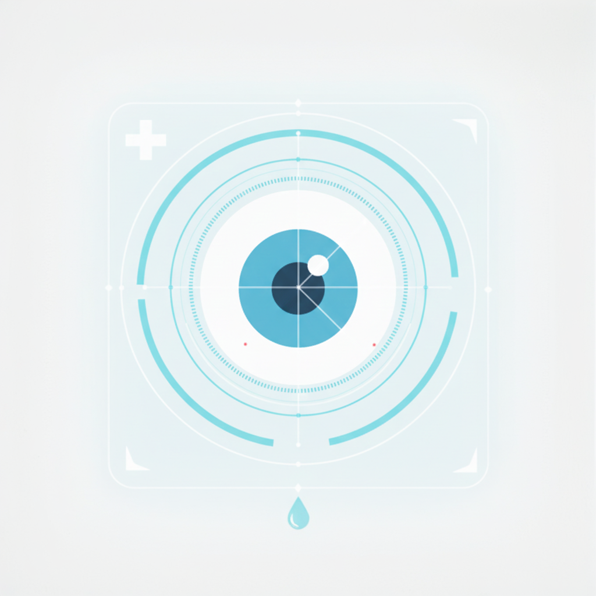
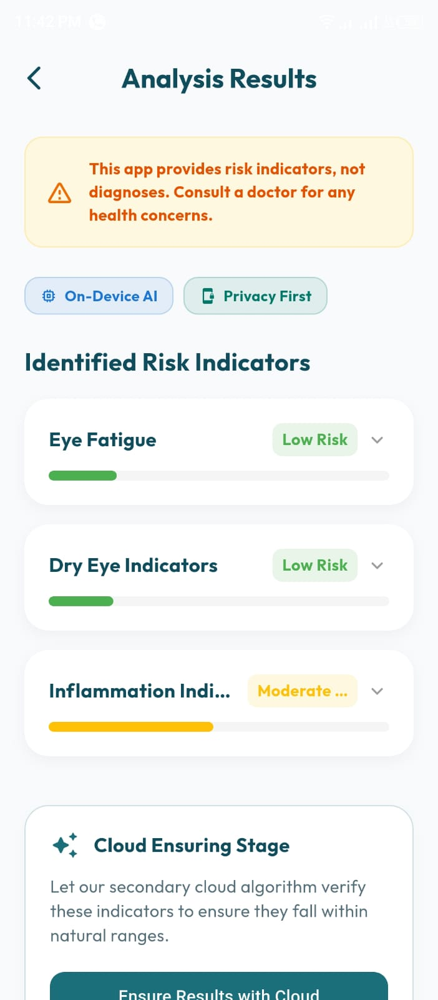
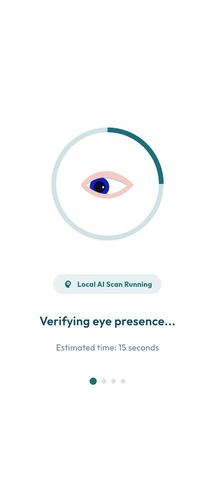
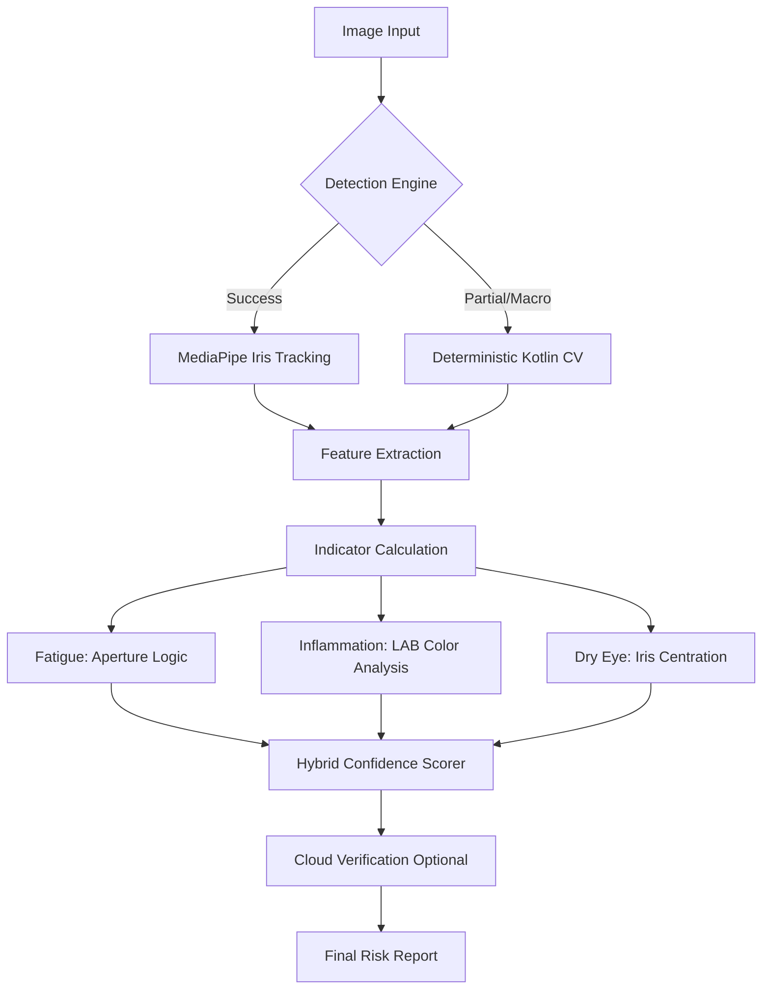

<div align="center">
  
  <h1>EyeCare AI</h1>
  <p><strong>Advanced On-Device Eye Health Monitoring & Computer Vision Analysis</strong></p>

  [](https://flutter.dev)
  [](https://kotlinlang.org)
  [](https://developers.google.com/mediapipe)
  [](https://openrouter.ai)
</div>

<hr>

## 📌 Overview

**EyeCare AI** is a sophisticated mobile surveillance platform for ocular health. It implements a unique **Eye-First** architecture that prioritizes the eye as an independent object of analysis rather than a facial feature. By combining **Native Kotlin Computer Vision**, **Google MediaPipe**, and **Large Vision Models (LVMs)**, EyeCare AI provides a comprehensive risk assessment for fatigue, dryness, and inflammation.

---

## 🛠️ Technical Deep Dive

### 1. The Multi-Stage Vision Pipeline
Unlike standard face-tracking apps, EyeCare AI employs a hierarchical detection flow:

*   **Primary Layer (MediaPipe Iris):** Utilizes GPGPU accelerated landmarks to isolate the iris, pupil, and sclera boundaries. It extracts high-precision coordinates even in challenging angles.
*   **Secondary Layer (Deterministic Fallback):** A non-ML, rule-based CV engine written in pure Kotlin. It uses **LAB and HSV color space analysis** to detect sclera "whiteness" and iris "circularity" when facial landmarks are unavailable (e.g., macro close-ups).
*   **Tertiary Layer (Hybrid Scorer):** Integrates the signals from both layers into a weighted confidence matrix.

### 2. Ocular Indicator Logic
The app maps visual signals to health indicators using advanced biomechanical and chromatic heuristics:

*   **Eye Fatigue Risk:** Calculated via the **Aperture Ratio**. The system monitors the ratio between the vertical eyelid opening and horizontal eye width. A ratio deviation below 0.25 triggers high fatigue indicators.
*   **Inflammation Indicator:** Uses **LAB Chromaticity Analysis**. The engine isolates the sclera region and measures the `a*` channel intensity. Positive shifts in the `a*` spectrum (moving toward the red axis) are normalized to detect vascular congestion.
*   **Dry Eye Indicators:** Assessed through **Iris Centration Symmetry**. The system measures the iris's deviation from the geometric center of the eye boundary, which often correlates with ocular surface strain and tear film instability.

### 3. Hybrid AI Validation (Stage 2)
For high-risk detections, the app can delegate a cropped payload to **Google Gemini 1.5 Flash (via OpenRouter)**. This "Cloud Ensuring" stage uses specialized system prompts to validate the local findings using a multi-billion parameter vision model, providing a professional-grade second opinion.

---

## 📸 Visual Showcase

<div align="center">
  <table>
    <tr>
      <td></td>
      <td></td>
      <td></td>
      <td></td>
    </tr>
    <tr>
      <td align="center">Uploading Image</td>
      <td align="center">Indicator Results</td>
      <td align="center">Analysis Processing</td>
      <td align="center">Find Healthcare</td>
    </tr>
  </table>
</div>

---

## 🏗️ Architecture



---

## 🚀 Installation & Setup

### Prerequisites
- Flutter SDK (3.x)
- Android Studio / VS Code
- Android Device (API 21+)

### Steps
1. **Clone & Install:**
   ```bash
   git clone https://github.com/qhmed67/EyeCare.git
   cd EyeCare
   flutter pub get
   ```

2. **API Configuration:**
   Navigate to `lib/services/analysis_service.dart` and insert your OpenRouter API Key:
   ```dart
   static const String _apiKey = "YOUR_OPENROUTER_KEY";
   ```

3. **Build & Run:**
   ```bash
   flutter run
   ```

---

## 🛡️ Privacy & Compliance
- **Local First:** All primary biometric analysis happens strictly on-device.
- **Anonymized Cloud:** Only relevant eye crops are sent for cloud verification; no facial identifiers are transmitted.
- **Disclaimer:** This application is strictly for physiological monitoring and does not provide medical diagnosis.

---

<div align="center">
  <p>Developed with ❤️ by <strong>Ahmed Youssef</strong></p>
  <p><i>Harnessing Computer Vision for a healthier vision.</i></p>
</div>
